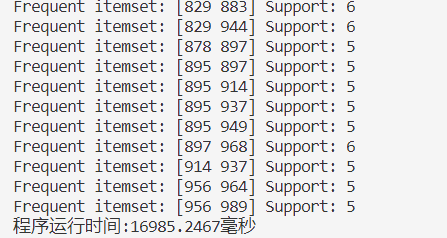
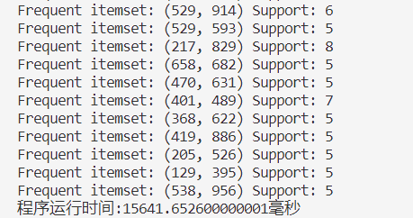
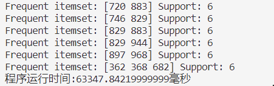
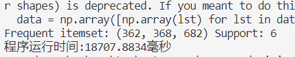

## Q2. 

Implement two frequent itemset mining algorithms selected from: (1)  Apriori, (2) FP-growth, and (3) Eclat (mining using vertical data format), using a programming  language that you are familiar with. Compare the performance of each algorithm with two given  datasets.

#### (a) Apriori

代码思路：

设置超参数，文件IO读入数据库文件，设置读取多少行transaction：

```python
# 设置支持度
support_rate = 0.06
# 设置频繁几项式
n = 3
# 设置读取几条transaction
max_line = 100

with open(file_name, 'r') as f:
    for line in f:
        line = line.split()
        _data = [int(x) for x in line]
        datalist.append(_data)
        flatdata = np.append(flatdata, _data)

        line_count += 1

        if line_count >= max_line:
            break  # 当达到100行时停止读取
```

首先计算1频繁项集

```python
# data = np.array([np.array(lst) for lst in datalist])
data = np.array(datalist, dtype=object)

begin_time = time.perf_counter()
# 查找data中所有唯一项，并分别统计这些唯一项在data中出现的次数
unique, counts = np.unique(flatdata, return_counts=True)

# 通过向量操作使得小于支持度的值去除
flag = np.where(counts < support_rate * max_line, 0, 1)
one_frequent = unique * flag

# 将counts中小于support_rate*max_line的项去除，将one_frequent中为0的项去除
one_frequent_counts = np.delete(counts, np.where(counts < support_rate * max_line))
one_frequent = np.delete(one_frequent, np.where(counts < support_rate * max_line))

```

然后计算2频繁项集及n频繁项集，之所以分开2频繁项集及n频繁项集是因为1频繁项集的每一项并不是list，而是int。

```python
while step < n:
    step += 1
    if step == 2:
        combinations_list = list(combinations(frequent, 2))
        frequent = np.array(combinations_list)
        frequent_counts = np.zeros(len(combinations_list), dtype=int)
        for frequent_index, frequent_item in enumerate(frequent):
            for transaction_index, transaction in enumerate(data):
                if (frequent_item[0] in transaction) and (frequent_item[1] in transaction):
                    frequent_counts[frequent_index] += 1
        
        delete_indices = np.where(frequent_counts < support_rate * max_line)

        # 删除a中与b中值为零的项对应的行
        frequent = np.delete(frequent, delete_indices, axis=0)
        frequent_counts = np.delete(frequent_counts, delete_indices)
        print(frequent)
        print(frequent_counts)
    elif step > 2:
        new_frequent = []
        for i, list_i in enumerate(frequent):
            for j, item_j in enumerate(one_frequent):
                if item_j in list_i:
                    continue
                new_list = list(list_i)
                new_list.append(item_j)
                new_list.sort()
                if tuple(new_list) not in new_frequent:
                    new_frequent.append(tuple(new_list))
        frequent = np.array(new_frequent)
        frequent_counts = np.zeros(len(new_frequent), dtype=int)
        for frequent_index, frequent_item in enumerate(frequent):
            for transaction_index, transaction in enumerate(data):
                if all(item in transaction for item in frequent_item):
                    frequent_counts[frequent_index] += 1

        delete_indices = np.where(frequent_counts < support_rate * max_line)

        # 删除a中与b中值为零的项对应的行
        frequent = np.delete(frequent, delete_indices, axis=0)
        frequent_counts = np.delete(frequent_counts, delete_indices)

        if len(frequent) == 0:
            print("没有 " + str(step) + " 频繁项集了")
            break
        print(frequent)
        print(frequent_counts)
```

#### (b) Eclat 

代码思路：

首先设置超参以及读取数据库：

```python
# 设置支持度
support_rate = 0.05
# 设置频繁几项式
n = 2  # 这里假设你要挖掘频繁2项集，可以根据需要修改n的值
# 设置读取几条transaction
transaction_num = 100

file_name = os.path.join("tdb2.dat")
datalist = []
line_count = 0

with open(file_name, 'r') as f:
    for line in f:
        line = line.split()
        _data = [int(x) for x in line]
        datalist.append(_data)

        line_count += 1

        if line_count >= transaction_num:
            break  # 当达到100行时停止读取

data = np.array([np.array(lst) for lst in datalist])
```

*定义函数来生成候选项集*

```python
def generate_candidates(itemset, size):
    candidates = set()
    for item in itemset:
        for other in itemset:
            if item != other:
                candidate = tuple(sorted(set(item + other)))
                if len(candidate) == size:
                    candidates.add(candidate)
    return list(candidates)
```

*定义函数来计算项集的支持度*

```python
def calculate_support(itemset, data):
    count = 0
    for transaction in data:
        if set(itemset).issubset(set(transaction)):
            count += 1
    return count / len(data)
```

*生成频繁1项集*

```python
candidates = [(i,) for i in range(1, 1001)]
for candidate in candidates:
    support = calculate_support(candidate, data)
    if support >= support_rate:
        frequent_itemsets[candidate] = support
```

 *生成频繁n项集*

```python
for size in range(2, n + 1):
    candidates = generate_candidates(list(frequent_itemsets.keys()), size)
    for candidate in candidates:
        support = calculate_support(candidate, data)
        if support >= support_rate:
            frequent_itemsets[candidate] = support
```

*输出指定的频繁n项集*

```python
for itemset, support in frequent_itemsets.items():
    if len(itemset) == n:
        print("Frequent itemset:", itemset, "Support:", int(support*transaction_num))
```

#### (c) 实验

**<u>*默认Apriori在上，eclat在下*</u>**

读取tdb2.dat数据100条，支持度为0.05，计算频繁二项集：





读取100条，计算 3 频繁项，支持率为 0.06 **（最大为0.06，再小就算的太慢了）**：





其他超参就不算了，再增加transaction条数或者3+频繁项集就算的太慢了。

#### (4) 结论

1. **Data Size**:
   - Apriori算法：在处理大规模数据时，Apriori算法需要多次扫描数据来生成候选项集，这会使得频繁访问io，拖慢速度。
   - Eclat算法：Eclat算法使用了垂直数据格式，减少了io次数，运算更快。
2. **Data Distribution**:
   - Apriori算法：apriori算法在稀疏数据上效果不好，很多候选集达到支持度阈值，浪费运算时间。
   - Eclat算法：Eclat算法对稀疏数据处理更好，因为它不需要生成所有可能的候选项集，而是专注于频繁的项集。
3. **Minimal Support Threshold Setting**:
   - Apriori算法：设置较低的Threshold 可能会导致生成大量无用的候选项集增加计算开销。设置较高的最小支持度阈值又可能会漏掉潜在的频繁项集。
   - Eclat算法：相对较低的最小支持度阈值可以更好地处理，因为它不会生成大量的候选项集，而是集中在垂直数据投影上。
4. **Pattern Density**:
   - Apriori算法：倾向于生成稠密的候选项集，因为它会生成所有可能的候选项集，包括那些不太频繁的项集。
   - Eclat算法：生成相对较稀疏的频繁项集，因为它不会生成所有可能的候选项集，而是专注于频繁的项集。